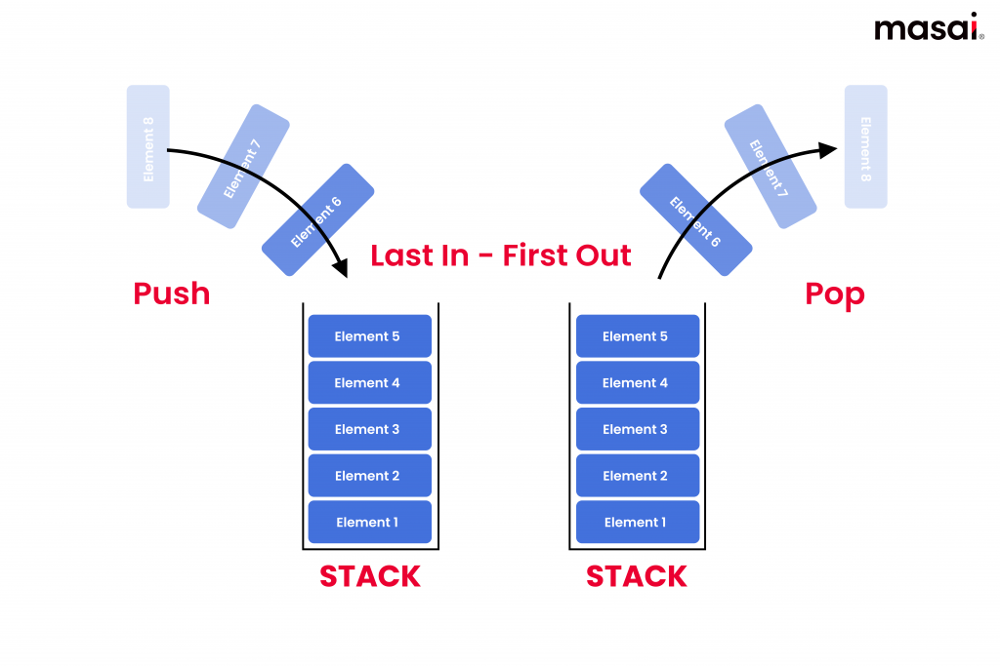

# Stack

A stack is a very useful tool in the kit of a developer. It allows for the simple management of data, kept in an even simpler order:



A stack can be described as a **LIFO (Last In First Out)** or **FILO (First In Last Out)** data structure. This simply means that the last piece of data put into the structure will be the first to come out when the correct method is called, or vice verse. The many advantages we will go over in this lesson will show why a stack is such a powerful tool.

A stack behaves like a stack of books- _pushing_ adds a book on the top of the stack, and _popping_ takes the top book off.


## 1.0 The purpose of a stack

A stack is used for many reasons in programming, but as previously mentioned, the main reason is to keep data organized in a specific order. One common example is handling multiple function calls or recursion, which is **when a function calls itself**. Many compilers rely on stacks to manage function execution.

> "Stacks are a simple and easy-to-understand data structure, making them suitable for a wide range of applications" (Geeks for Geeks, 2024).

### 1.1 A stack's preformance

One of the biggest advantages of a stack is its preformance in regards to the Big O notation of the data structure:

    O(1)

This means that no matter how many "books" or data you put into a stack, it will always take the same amount of time to either **add** a book on top, **remove** a book from the top, or **read** the top book.

## 2.0 The syntax of a stack

When coding in C#, creating a new stack object is fairly straight forward:

```csharp
Stack<int> stack = new Stack<int>();
```

This will initialize a new stack called _"stack"_.

To push something onto the stack, in this case an integer, all you have to do is this:

```csharp
stack.push(1);
stack.push(2);
stack.push(45);
stack.push(10);
```

To pop something off of the stack, all you do is this:

```csharp
stack.pop();
stack.pop();
```

You can even set a variable equal to the popped value:

```csharp
value1 = stack.pop();
```

The third useful method in this data structure is called peek(). This lets you get the value of the top of the stack without having to remove it. This is the syntax:

```csharp
Stack<string> movies_2024 = new Stack<string>;

//Adding movies to the stack
movies_2024.push("Despicable Me 4");
movies_2024.push("Godzilla x Kong");
movies_2024.push("Inside Out 2");

//prints out the latest movie to be added to the stack, which was the latest release at the time.
Console.WriteLine("The most recent movie to come out is: " + movies_2024.Peek());
```

Stacks also have an attribute, which is called Count. This returns the "height" or length of a stack (how many books are stacked on top of one another). It looks like this:

```csharp
int stack_height = stack.Count;
Console.WriteLine(stack_height);
```

### 2.1 Where would you use this?

### 2.2 Simple example solution

Here is an example of using a stack to reverse a string in C#:

```csharp
//This is the given string to reverse
var starting_word = "hello"

//initialize the stack
Stack<char> char_stack = new Stack<char>();

//Now we will iterate through each character in the string, pushing each subsequent character onto the stack.
foreach (char c in starting_word){
    char_stack.Push(c);
}

//Now we will pop each character, and add it to a list, then use a join method to return a reversed string
bool empty = false;
List<char> char_list = new List<char>();

while (!empty){
    if (char_stack.Count == 0){
        empty = true;
    }
    else{
        char top_char = char_stack.Pop();
        char_list.Add(top_char);
    }
}

//Now print the joined list into a string.
Console.WriteLine(string.Join("", char_list));
```

## 3.0 Pros and Cons of a stack

### 3.1 Advantages

A list of advantages will be put here

### 3.2 Disadvantages

A list of disadvantages will be put here

## 4.0 Problem to solve: Library's return system (to be done by monday)

[Back to welcome page](0-welcome.md)

## Sources

[Geeks for Geeks](https://geeksforgeeks.org)
